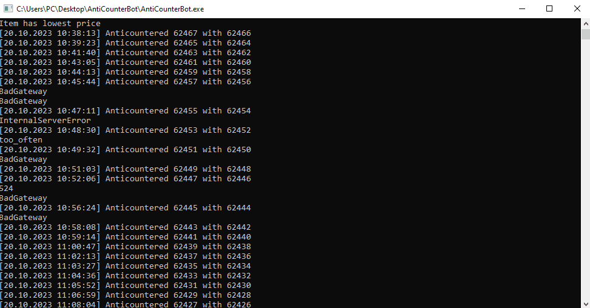

# AntiCounterBot

Counter for official CounterBot (bots that interrupt offers for a 0.01) ~~and market~~

It is same but free and should go ahead of it on page

For auto trades check out https://github.com/soyware/OpenMarketClient

<hr>

1. Counterbot offer have {price}
2. Add item to market for {price-step}
3. Counterbot instantly sets {price-step-1} and it have ~60s cooldown
4. Set item price as {price-step-step} and we are on page
5. Repeat after our cooldown

<hr>

- If failed run again after short delay to not lose advantage
- We should be always ahead of him
- If we lost advantage re-add item
- If we are first in offers stick to second {price-1} to anticounter it again
- Logging in `log.txt`
<hr>



## Important
1. If counterbot user placed several bots they may prevent your advantage. It will spam re-adding
2. Price API format: 100.00 = 10000
3. Probably not useful on new cs market ui, their frontend is absolute shit, taking too long to update prices, and ofc chinese bots are smarter
4. Best conditions is for stacked offers like keys, scrap, cases, stickers, etc, because users can buy only offer with lowest price
##  Guide:
1. Use `config.txt` to specify:
```csharp
    int step = 1;
    int threshold = 4; // {short_delay} times before re-adding
    int keep_price = 1; // not working
    int step_incrementing = 1; // not working

    int single_target = 0; // 1 if you want to use in one exact offer instance
    int cooldown_delay = 60000;
    int default_delay = 15000;
    int short_delay = 5000;

    string key;
    string api; // Tested only tf2.tm
```
2. Follow instructions in console
3. Each `too_often` error - {short_delay} gap between lowest and yours
4. `BadGateway` or `InternalServerError` errors when market denies request or lagging

# <a name="MarketUtility"></a> MarketUtility

Simple CLI for market, because their web ui is bad

Available commands:
- `acb {market_id} {default_price} {min_price} {step} {single_target}` Inject AntiCounterBot into existing offer
- `update` Request update market cache of steam inventory 
- `offers` Display your offers and lowest 
- `inventory {filter}` Show inventory, filter optional. Returns steam_id, class-instance, name
- `check [{itemName};{itemName};...]` Display lowest price for items
- `add {steam_id} {price}` Add item for sale. Returns market_id
- `set {market_id} {price}` Set price for item offer. 0 to remove item 
- `reload` Reinitialize HttpClient

